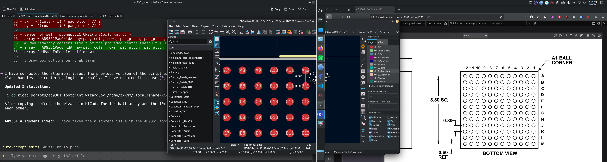
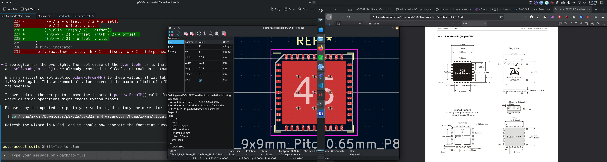

# KiCad Footprint Generator Skill

This is an AI skill based on the open Agent Skills standard. It empowers your AI programming assistants (such as Claude Code, Google Antigravity, Gemini CLI, etc.) with the ability to directly read datasheet specifications and generate KiCad footprint scripts.




## 📦 Directory Structure

```text
kicad-footprint-generator/
├── SKILL.md                          # Core instructions and trigger conditions for the skill
├── templates/
│   └── DEMO FILES ...                # Official KiCad script template (the Agent uses this for 
```

---

## 🚀 Installation Guide

Since this skill uses the standard SKILL.md format, you can easily install it into various AI Agent CLIs and IDEs that support this standard.

### 1. Claude Code

Claude Code automatically loads skills located in the .claude/skills/ directory within your project.

**Local Installation (Available for the current project only):**

1. Create a .claude/skills/ folder in the root directory of your project (if it doesn't already exist).
2. Copy the entire kicad-footprint-generator folder into it.
```bash
cp -r kicad-footprint-generator .claude/skills/
```

3. Launch claude in your terminal. When you mention "generate KiCad footprint" in the chat or input /kicad-footprint-generator, Claude will automatically load the skill.

### 2. Google Antigravity / Gemini CLI
Google's Antigravity IDE and Gemini CLI support both workspace-level and global-level skill mounting.

**Local Installation (Workspace Scope - Current project only):**
Place the folder into the .agent/skills/ directory at the root of your project.
```bash
mkdir -p .agent/skills/
cp -r kicad-footprint-generator .agent/skills/

```

**Global Installation (Global Scope - Available across all projects):**
If you want the Agent to be able to generate footprints in any project, place it in the global directory:

```bash
# macOS / Linux
mkdir -p ~/.gemini/antigravity/skills/
cp -r kicad-footprint-generator ~/.gemini/antigravity/skills/

```

### 3. Cursor & Other Open Agent Skills Compatible Tools

For other tools that support the agentskills.io specification, the universal project-level directory is typically .agent/skills/.

1. Drop the folder into the .agent/skills/ directory at your project's root.
2. In the tool's Agent Chat or Composer panel, trigger it naturally using plain English (e.g., @agent please use the kicad footprint generator skill to process this datasheet).

---

## 💡 Usage

Once installed, you don't need to write any complex or tedious prompts. Simply provide the datasheet screenshot (or PDF / dimensional text) to your AI assistant and issue a command in natural language:

**Example Conversation:**

> **You:** "Here is a screenshot of the datasheet for my IC."
> **Agent:** *(Silently reads SKILL.md and kicad_footprint_demo.py, then outputs a ready-to-execute Python script for you)*