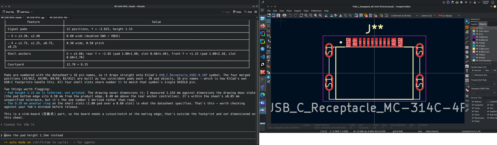
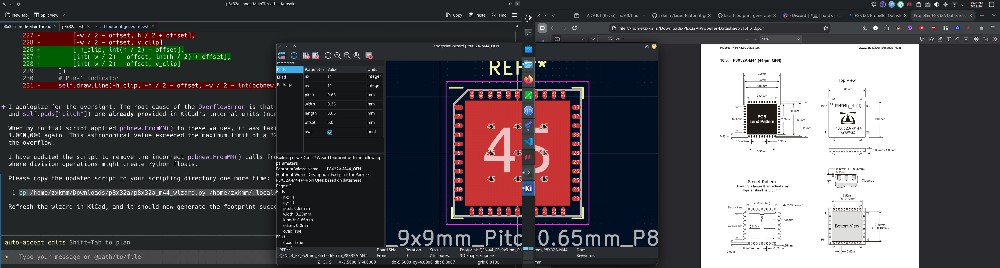
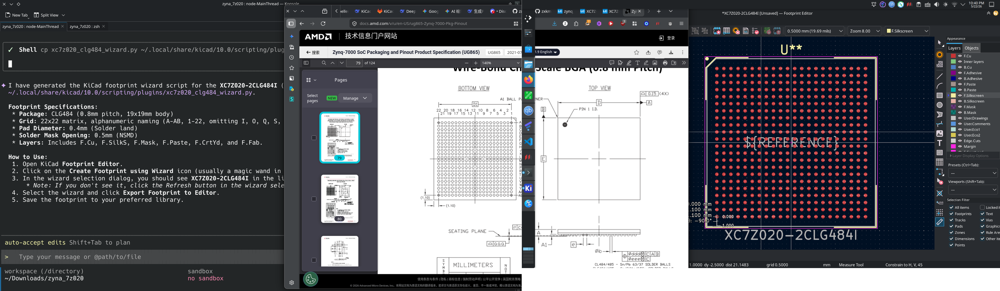

# kicad-harness

Gives an AI coding agent **eyes and hands** on a KiCad project — and a way to
teach itself.

One [Agent Skill](https://agentskills.io) plus the Python tool behind it. The
agent can look up real symbols and footprints in your own libraries, read
positions and nets, render any region of the board or schematic to PNG and
actually look at it, run DRC/ERC, edit a board open in KiCad over IPC — and,
when no library has the part, **generate its footprint from the datasheet**.

> This repo used to be two: `kicad-harness` and `kicad-footprint-generate`.
> They are one skill now — making a footprint is just what you do when `kh fp`
> comes back empty. This is the only repo that gets updates.

## Self-iteration — the point of this repo

**The agent is expected to edit this repo while using it.**

A skill that never changes rots. KiCad ships a new version, an API moves, a
documented line turns out to be wrong, a package family needs a rule nobody wrote
down. Whoever notices should fix it, and the one who notices is the agent,
mid-task, at the moment it hurt.

So the rule, written into the top of `SKILL.md`: **notice → fix the repo →
commit → push.** In the same session, not "worth mentioning later". Measured
KiCad behaviour is the most valuable thing an agent can leave behind, because the
next one cannot guess it from source.

- **Using it yourself:** clone it, symlink it into your skills directory, and let
  the agent commit. The skill directory *is* the checkout, so its fixes are
  already in git.
- **Using a fork, or no push access:** fork away, that is what forks are for —
  but please send it back as a PR here. A fix that stays in a fork helps one
  person; upstream it helps every agent that installs this.

The full protocol — what is worth writing down, which file it goes in, commit
hygiene, what never to commit — is [`docs/SELF_ITERATION.md`](docs/SELF_ITERATION.md).
Things found broken but not fixed are logged in [`ISSUES.md`](ISSUES.md).

## The CONCEPT

### This is for
- Assist designing: Assist you make partial circuit without copying recommend design from datasheet, for example, correctly use a Op-Amp.
- Do the "worky" job for you: fanout for weird shaped BGA, calculating and then layouting LC ladder filter, naming BGA balls one by one when generating a footprint.
- General helper: Review your design, offer help when you are stuck in designing.
- A PoC to display what current frontier LLM can do in PCB designing.

### This is not
- An overall better than human PCB designer.
- Designing PCB from scratch (though it can).
- Something that designing faster and better than human (in complex but not trivial tasks, such as "Designing PCB from scratch" as listed above), this is actually quite low speed, for the demo project it cost nearly 1 hours to finish.

## Demos

### TP4056 battery charge controller


Use Claude Opus 5 in Claude Code, with [this prompt](https://gist.github.com/zxkmm/f82bf892a644cc1c30c1e2ab79ce8476);
Cost (Assume no subscription plan): 350 input, 158.6k output, 22.9m cache read, 279.5k cache write ($18.22)

**What it made good:**
- Design is correct.
- DRC/ERC passed.

**What it made bad:**
- Didn't add copper fill zone, all GND were wired, though usable.
- Placement isn't good, though usable.

**Get the demo project** [Here](https://github.com/zxkmm/kicad-harness-demo-board-tp4056);
The commit `5ca3f4d13f3e9c7d809f661c0eeaeb0bf86a3caf` is untouched project file that generate purely by harness.

### Footprints, straight off a datasheet




## Requirements

Linux or another UNIX-like system works best. Windows should be fine, but agents
often confuse PowerShell and CMD syntax there.

Needs **KiCad 9 or 10** (tested on 10.0.5), `kicad-cli`, and `rsvg-convert`.
Footprint generation needs only KiCad's `pcbnew` Python module.

## Install

Launch a session in any agent that supports the Agent Skills standard — Claude
Code, Google Antigravity, Gemini CLI, Cursor — and paste:

```
Can you please install this skill for yourself: `https://github.com/zxkmm/kicad-harness.git`
```

By hand, for Claude Code — symlink rather than copy, so the agent's own fixes
land in git:

```bash
git clone https://github.com/zxkmm/kicad-harness.git
ln -s "$PWD/kicad-harness" ~/.claude/skills/kicad-harness
```

For Cursor and other agentskills.io-compatible tools the project-level directory
is typically `.agent/skills/` — same idea. Then just ask in plain English:
*"check this board"*, *"place these parts"*, *"make a footprint for this
datasheet"*.

Then install the `kh` tool:

```bash
./setup.sh
```

The venv is created with `--system-site-packages` because `pcbnew` is installed by
KiCad into the system interpreter and cannot be pip-installed.

For the live layer, enable the API server in KiCad:
**Preferences → Plugins → "Enable KiCad API"**. It ships off.

## Layers

| Layer | Needs | Gives you |
|---|---|---|
| **libraries** | nothing | real symbol/footprint ids and pin numbers, from the user's own libs |
| **offline** | nothing | component positions, bboxes, nets, DRC, ERC, netlist, BOM |
| **visual** | nothing | any board region rendered to PNG — the agent looks at the layout |
| **live** | API server enabled | edit a board open in KiCad, with proper undo |
| **footprints** | nothing | a datasheet → a hardcoded wizard script and a `.kicad_mod` |

## Use

```bash
kh sym TP4056                                  # find a real symbol id
kh sym --pins Battery_Management:TP4056-42-ESOP8   # pin numbers, types, coordinates
kh sym --sexpr Device:R                        # raw symbol body, for lib_symbols
kh fp "USB_C receptacle"                       # find a real footprint id
kh validate --symbols A,B --footprints C       # check ids before using them

kh info                                        # board summary
kh ls --filter Inductor                        # parts, positions, bounding boxes
kh nets --net GND                              # every pad on a net

kh view --refs L1,L2,C3 --margin 3 --out v.png # frame those parts and render
kh view --region 45,55,20,20 --out v.png       # explicit mm window
kh view --layers courtyard --refs U1           # check for overlap

kh sview --all --out sch.png                   # render every schematic sheet
kh sview --sheet Power --region 130,112,102,43 # one sheet, zoomed, in mm

kh board-from-netlist --sch . --outline 20,20,38,26.5   # netlist -> .kicad_pcb
kh place --pcb . --set U1=40,29 --set C1=33.5,34.5      # move parts, no KiCad
kh outline --pcb . --rect 20,20,38,26.5                 # Edge.Cuts rectangle

kh drc                                         # violations grouped by type
kh erc
kh netlist --out n.net

kh live                                        # is the IPC connection up?
kh exec place_filter.py                        # run a script against running KiCad
```

Pass `--pcb` / `--sch` to point at a project; otherwise the current directory is
searched. All output is JSON.

Footprint generation needs no CLI — hand the agent a datasheet screenshot, PDF or
dimension table and it measures the drawing, writes a hardcoded wizard script,
overlays the generated pads back onto the datasheet to prove they line up, and
exports the `.kicad_mod`.

## The loop

```
kh ls        →  find the parts
kh exec      →  move them (live, one undo step)
kh view      →  render the result
   look      →  read the PNG
kh drc       →  confirm nothing broke
```

Step 4 is the whole point. A placement script that runs cleanly can still be
visibly wrong — parts rotated 90° off, a filter in the wrong order, courtyards
overlapping. Only the image catches that. Footprints get the same treatment: the
pads are drawn back over the datasheet and looked at, because a wizard script
that exits 0 proves nothing about its geometry.

## Notes

- Offline tools read the **last-saved file**. Save before rendering.
- **`board.save()` over the live layer loses data.** The round-trip through the
  API model drops locked graphics and User-layer construction geometry, without
  an error. Save from KiCad instead; move parts with offline `kh place`.
- The live API speaks **nanometres**; the CLI speaks millimetres. Use
  `Vector2.from_xy_mm(...)`, never a hand conversion.
- **No ratsnest in renders** — SVG export omits airwires. Use the `unconnected`
  section of `kh drc` instead.
- **No schematic editing API** — kipy's schematic module is present but
  non-functional, explained in `docs/CAPABILITIES.md`. Schematics are edited as
  text.
- **No built-in autorouter**, but Specctra DSN export / SES import both work
  headless from Python, so an external router can be driven with no clicks.
- **No template fits an irregular land pattern.** USB-C, card edges and most
  connectors need an explicit pad table, not a bent `PadArray`.

## Documentation

- [`docs/SELF_ITERATION.md`](docs/SELF_ITERATION.md) — how the agent maintains
  this repo, and how to send a fix back
- [`docs/CAPABILITIES.md`](docs/CAPABILITIES.md) — what KiCad exposes, measured
  rather than assumed, including why the schematic API that appears to exist in
  kipy's source does not actually work
- [`docs/LIVE_API.md`](docs/LIVE_API.md) — the kipy object model
- [`docs/RECIPES.md`](docs/RECIPES.md) — worked examples, including authoring a
  `.kicad_sch` from scratch
- [`docs/SCHEMATIC_EDITS.md`](docs/SCHEMATIC_EDITS.md) — changing a schematic
  someone already drew, without wrecking the rest of it
- [`docs/footprints/`](docs/footprints/) — the footprint side: `MEASUREMENT.md`
  (getting exact dimensions out of a drawing), `GUIDE.md`, `API_REFERENCE.md`,
  `VERIFICATION.md`, `ENVIRONMENT.md`, `EXAMPLES.md`
- [`templates/`](templates/) — the official KiCad wizard blueprints (QFP, BGA,
  QFN, FPC, connectors …)

## Cautions

The reliability and usability of this tool are highly dependent on the
capabilities of the AI you are using:

| Footprint Type                                                                                                     | Difficulty for AI | Model                          | Quality |
| -------------------------------------------------------------------------------------------------------------------- | ------------------- | -------------------------------- | --------- |
| BGA                                                                                                                | ⭐                | Gemini 3.5 Flash               | Good    |
| SOP/SOIC/SOT                                                                                                       | ⭐⭐              | Latest Claude Sonnet           | Good    |
| QFP                                                                                                                | ⭐                | Gemini 3.5 Flash               | Good    |
| QFN                                                                                                                | ⭐⭐              | Gemini 3.5 Pro                 | Good    |
| Regular DIP (LED, pin header etc)                                                                                  | ⭐⭐              | Latest Claude Sonnet           | Good    |
| Irregular pin arranged components (complex connectors, expensive LDOs that has weird pads and weird requirememnts) | ⭐⭐⭐⭐⭐        | Claude Opus 5 / Claude Fable 5 | Good    |
| Irregular pin arranged components (complex connectors, expensive LDOs that has weird pads and weird requirememnts) | ⭐⭐⭐⭐⭐        | Other AI                       | Bad     |

AI can make mistakes. This tool aims to speed up your workflow (e.g. save your
time to manually naming the number of the BGA balls one by one etc ...), manual
check is needed, and i'm not responsible for whatever loss this tool created.

## FAQ

- A: Why it works not as good as what you have shown?
  Q: This workflow rely on LLM capabilities very much. Only frontier LLMs can creates usable results.
- A: It probably takes as long as human to make designs.
  Q: You are half right, and moreover it actually takes longer to make a design than human. It took entire 1 hour to finish the demo project. That's why [the Concept](#the-concept) guides you what it good at, and what not.
- A: It takes same time for user to check the design.
  Q: It takes same time or even longer to check C to Assembly code for old developers too, until human finally made compilers that has very less bugs. And nowadays human barely check generated Assembly anymore. Same here, I'm not trying to forcibly hitch this mediocre project onto GCC's states; I am merely saying a broad principle regarding how a "reliable" thing forms. And not to say if you follow [the Concept](#the-concept), something this tool brings already faster than your bare hands.

## Contributing

Fork it if you like, but the fix is worth more here — see
[`CONTRIBUTING.md`](CONTRIBUTING.md).

## License

See [LICENSE](LICENSE).
